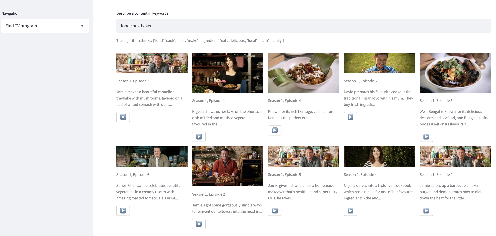
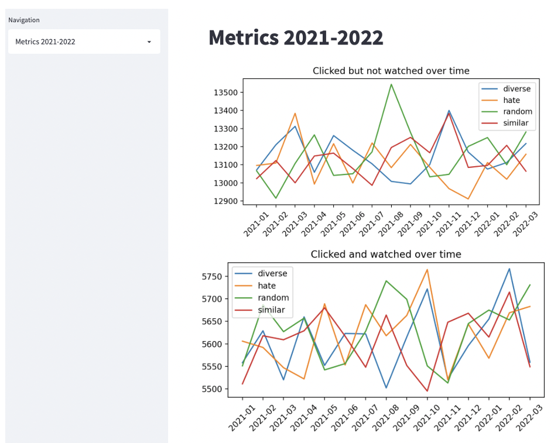

# TVNZ Recommendation System

A Personalized Recommendation System powered by a Topic Model (Latent Dirichlet allocation model) for **content-based filtering and AI-powered search** along with custom algorithms taking into account public values such as **transparency, fairness, diversity, social cohesion and serendipity**. In addition, user behavior (such as logs; implicit data) has been simulated for metric purposes.

## Data
Data consists of tv-program metadata scraped from [Television New Zealand](https://www.tvnz.co.nz) (TVNZ), a public television broadcaster in New Zealand.

## Code
- [Data simulator](https://github.com/ciCciC/RecommendationSysTopicModel/blob/master/notebooks/data_simulator.ipynb)
  - This notebook consist of code for simulating user behavior in order to obtain logs of implicit data
- [TVNZ scraper](https://github.com/ciCciC/RecommendationSysTopicModel/blob/master/notebooks/scraping_tvnz.ipynb)
  - This notebook applies Data Wrangling in order to create appropriate data for the recommendation system
- [Training Topic Model](https://github.com/ciCciC/RecommendationSysTopicModel/blob/master/notebooks/topic_model_tvprograms.ipynb)
  - This notebook applies sequential machine learning steps in order to develop a Topic Model for content-based filtering and AI-powered search within a recommendation system

## Prerequisite
```sh
pip install -r requirements.txt
```

## Preview

<br/>
Similarity - diversity ratio recommendation
<br/>


<br/>
Additional recommendations based on statistical data
<br/>


<br/>
Search TV contents by keywords (AI powered search)
<br/>


<br/>
Example metrics obtained from simulated user behavior
<br/>
