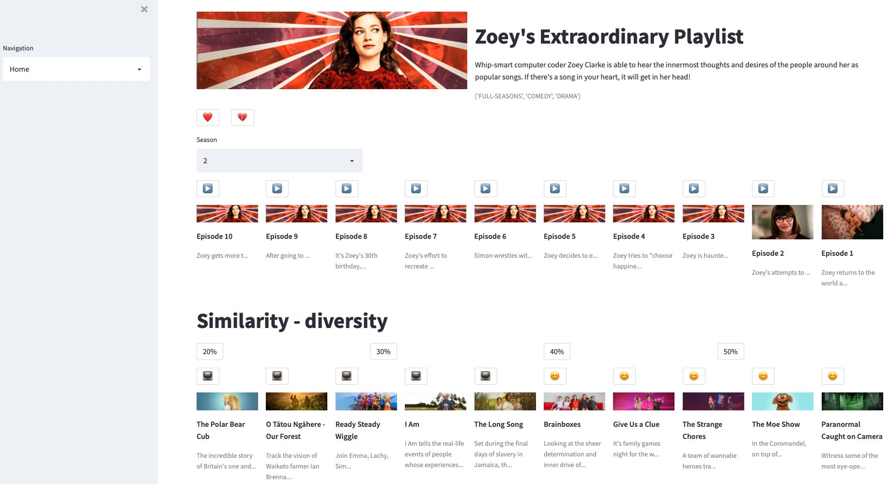
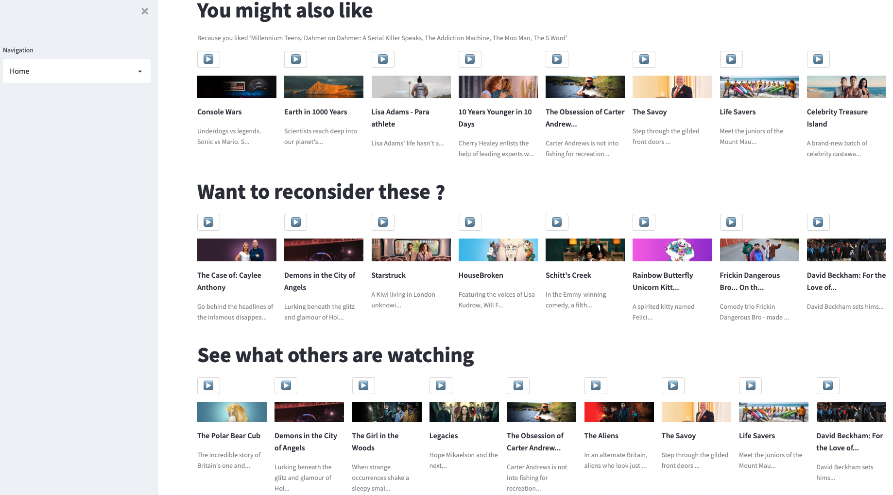
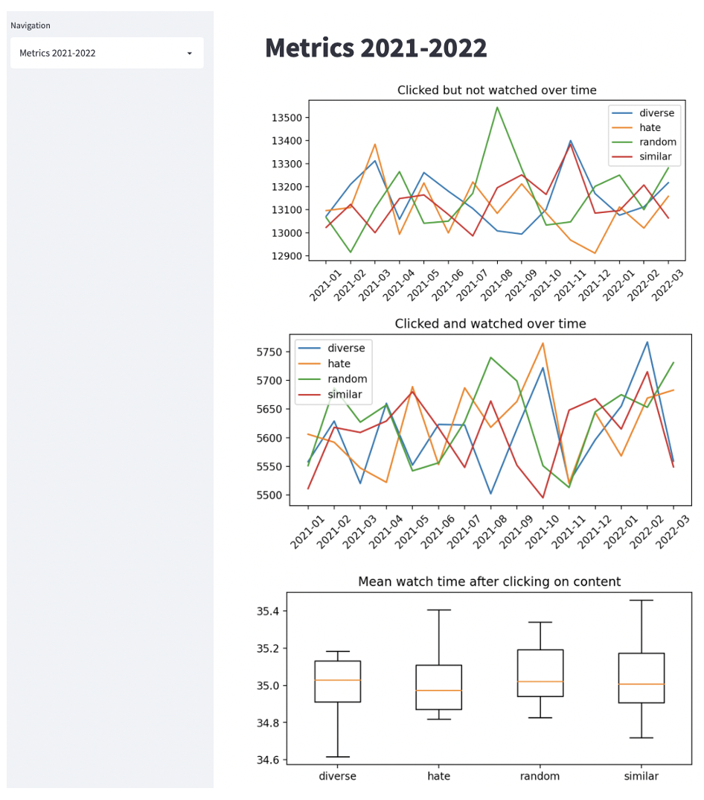

# Personalized Recommendation System

A Personalized Recommendation System using a Topic Model (Latent Dirichlet allocation model) along with custom algorithms taking into account public values such as transparency, fairness, diversity, social cohesion and serendipity. Additionally, metrics are generated by simulating user behavior.


### For installing all packages for this project
```sh
pip install -r requirements.txt
```

# Preview

<br/>
Similarity - diversity ratio recommendation
<br/>


<br/>
Additional recommendations based on statistical data
<br/>


<br/>
Example metrics obtained from simulated user behavior.
<br/>

